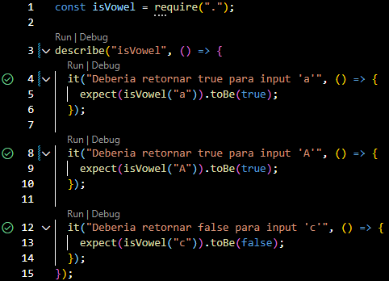

# jest-intro

Introducción al framework de testing Jest

### Requisitos

- [NodeJS](https://nodejs.org/en/download/current)
- [Jest (Framework de testing)](#instalar-jest)

### Instalar Jest
```bash
npm i --save-dev jest
```

### Instalación

```bash
npm run test
```

### Desarollo

```bash
npm run test:watch
```

Este comando nos permite ejecutar las pruebas cada vez que guardemos el archivo.

### Sugerencias

Instalación de la [extensión de VSCode Jest](https://marketplace.visualstudio.com/items?itemName=Orta.vscode-jest). Esta extención hace disponible opciones cómo "Run related test" = Ctrl + Alt + T que es util a la hora de ejecutar las pruebas. Tambien aparecen iconos del lado izquierdo de los test para describir los test, si fueron pasados o no por ejemplo, y, esto se verifica por cada vez que se guarde el archivo.



[Documentación de Jest]([link](https://jestjs.io/docs/getting-started))
